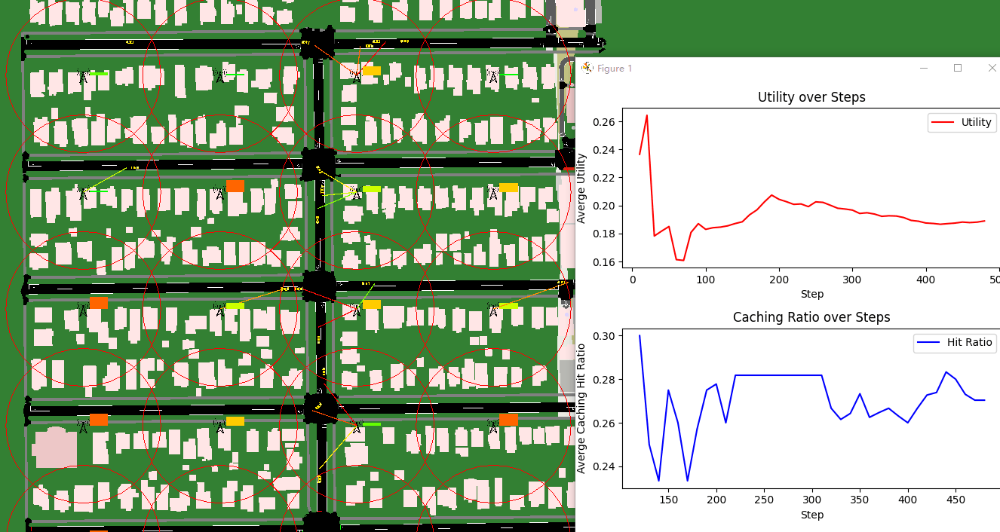
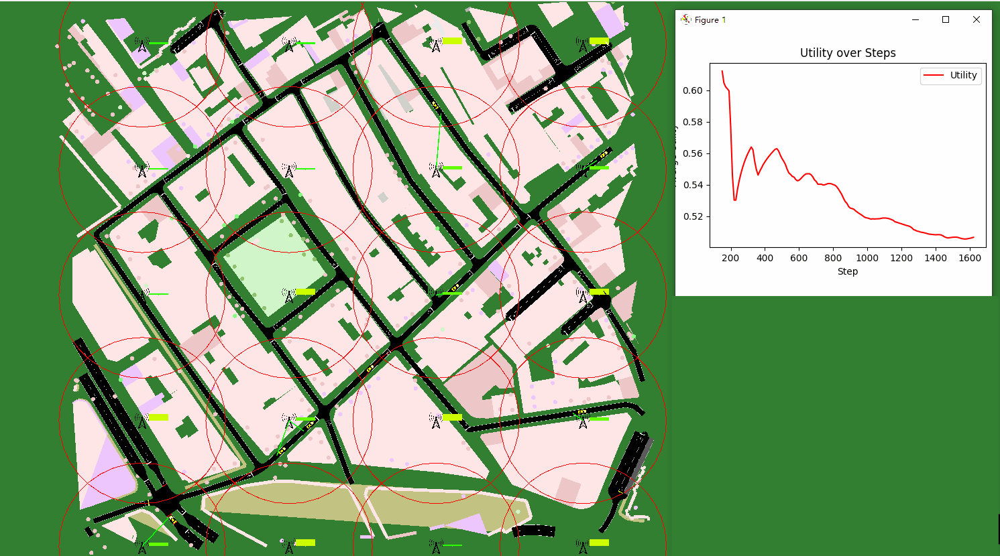

# CoMetaVanetEnv: Heterogeneous Multi-Agent Reinforcement Learning Environment in Mobile Computing Power Networking for the Metaverse Using SUMO

   

This project aims to create multi vanet env, using [SUMO](https://github.com/eclipse-sumo/sumo), rMAPPO-TS model based on [CADP](https://github.com/zyh1999/CADP).
This project:
- Provide a simple interface to work with Reinforcement Learning in Mobile Computing Power Networking for the Metaverse using SUMO API
- Support Multiagent Reinforcement Learning
- Compatibility (some modifications are required) with gymnasium.Env, PettingZoo.Env and popular RL libraries such as [RLlib](https://docs.ray.io/en/main/rllib.html) and [tianshou](https://github.com/thu-ml/tianshou)
- Easy customisation: modify anything in decoupled method.

This code is part of my academic research for the graduation thesis.

Random policy simulation in Seattle (Linden Avenue North 80-84th Street):


rMAPPO-TS (a marl method in my thesis) policy evaluation in London (Golden Square):


## Usage
### Init
Install requirements:
```bash
pip install -r requirements.txt
```

Run train.py to train marl model:
```bash
python train.py
```
Run eval.py to evaluation marl model:
```bash
python eval.py
```

## Results
### **Table 1: Applicability of Different Platforms**  
| Platform Name | Traffic Simulation | Communication Simulation | Resource Allocation | Extensibility |  
|--------------|------------------|------------------|------------------|--------------|  
| **[mobile-env](https://github.com/stefanbschneider/mobile-env)** | ❌ Not Supported | ✅ Supported | ⚠️ Only Supports Network Resource Allocation | ⚠️ Partially Extensible |  
| **[sumo-rl](https://github.com/LucasAlegre/sumo-rl)** | ✅ Supported | ❌ Not Supported | ❌ Not Supported | ❌ Not Extensible |  
| **CoMetaVanetEnv** | ✅ Supported | ✅ Supported | ✅ Supports Multi-Dimensional Resource Allocation | ✅ Highly Extensible |  
---

### **Table 2: Experimental Setup**  

| Parameter | Value |  
|-----------|-------|  
| **CPU** | i9-13900T, Max Turbo 5.3 GHz |  
| **GPU** | AMD Radeon 6800XT 16GB |  
| **RAM** | DDR5 32GB, Memory Frequency 5600MHz |  
| **Number of RSUs** | 20 |  
| **Map Size** | 400m × 400m |  
| **Seattle Vehicle Density** | 4000 vehicles/km/hr |  
| **London Vehicle Density** | 2000 vehicles/km/hr |  

---

### **Table 3: Simulation Efficiency of Different Baseline Algorithms**  

| Scenario | Strategy | Simulation Runtime (s) / Simulated Time (s) | Simulation Efficiency (Relative to Real-World Time) |  
|------------|-----------------------------|-----------------------------|------------------------------------|  
| **Seattle** | MAPPO (No GUI, Training) | 218s / 1024s | 4.69× |  
|  | Random (No GUI) | 130s / 1085s | 8.34× |  
|  | Random (With GUI) | 216s / 1085s | 5.02× |  
|  | Heuristic (No GUI) | 138s / 1085s | 7.86× |  
| **London** | MAPPO (No GUI, Training) | 78.8s / 1085s | 12.99× |  
|  | Random (No GUI) | 46s / 1085s | 23.5× |  
|  | Heuristic (No GUI) | 54s / 1085s | 20.09× |  
|  | FairAllocation (No GUI) | 54s / 1085s | 20.09× |  
|  | MAPPO (With GUI) | 142.74s / 1085s | 7.34× |  
|  | FairAllocation (With GUI) | 81.9s / 1085s | 13.24× |  
|  | Random (With GUI) | 84.018s / 1085s | 12.91× |  

---
